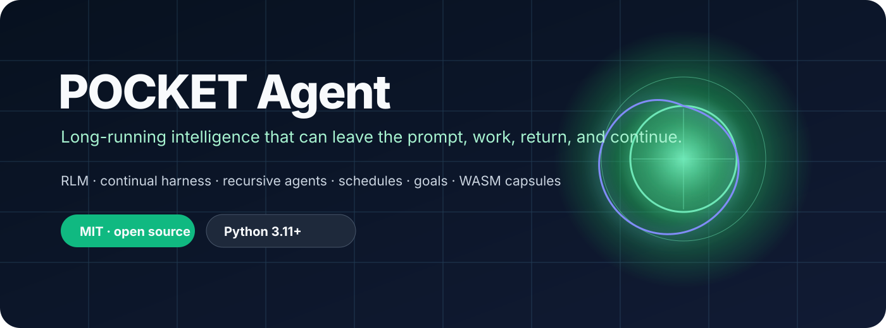
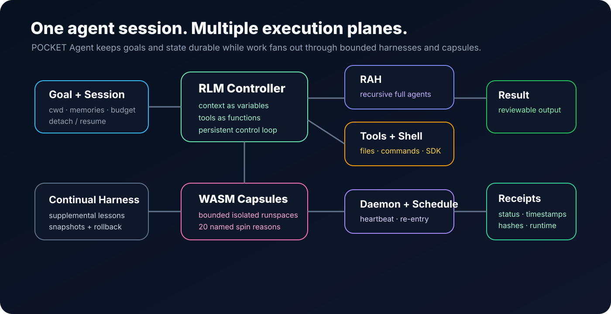

<p align="center">
  
</p>

<p align="center">
  
</p>

<p align="center">
  <a href="https://github.com/ItsNotAILABS/pocket-agent"></a>
  <a href="LICENSE"></a>
  
  
</p>

# POCKET Agent

**A long-running coding and research agent that can leave the prompt, keep working, return, and continue.**

POCKET Agent is the open execution plane of the POCKET family. It combines a persistent **RLM control environment**, a **continual harness**, recursive full-agent fan-out (**RAH**), daemon-backed sessions, schedules, durable goals, and bounded **WASM capsules** for work that should not run directly in the main workspace.

It is designed for repository-native work: inspect a codebase, hold a goal across turns, fan out difficult subproblems, execute tools, detach, re-enter on a schedule, and return with reviewable artifacts instead of losing the entire job when the chat window closes.

> **Not another single-turn coding wrapper.** The core abstraction is a persistent agent harness with lifecycle, recurrence, isolation, and evidence.

[Long-running agents](docs/LONG_RUNNING.md) · [RLM](docs/RLM.md) · [Continual Harness](docs/CONTINUAL_HARNESS.md) · [RAH](docs/RAH.md) · [WASM Capsules](docs/WASM_CAPSULES.md) · [POCKET host](https://github.com/ItsNotAILABS/pocket) · [Pocket Voice](https://github.com/ItsNotAILABS/pocket-voice-to-text)

---

## Install in one line

**macOS / Linux**

```bash
curl -fsSL https://raw.githubusercontent.com/ItsNotAILABS/pocket-agent/master/install.sh | sh
```

**Windows PowerShell**

```powershell
irm https://raw.githubusercontent.com/ItsNotAILABS/pocket-agent/master/install.ps1 | iex
```

Then enter any project:

```bash
cd /path/to/project
pocket-agent
```

The installer prepares the local runtime under `~/.pocket/agent/` and installs the `pocket-agent` command.

---

## What makes it different

| Capability | POCKET Agent |
|---|---|
| **Persistent session** | Detach from the terminal and reattach to the same agent state |
| **Durable goal** | Keep objective and progress across turns instead of re-prompting from scratch |
| **RLM** | Treat context as variables and tools/subagents as callable functions in a persistent control environment |
| **Continual harness** | `/refine` stores reviewable supplemental lessons and supports snapshots/rollback |
| **RAH** | Fan out complete agent harnesses for independent work, not only naked model calls |
| **Schedules + heartbeats** | Re-enter work periodically instead of depending on a human to reopen the session |
| **WASM capsules** | Move risky, parallel, WebGPU, or isolated work into bounded runspaces |
| **Agent messaging** | Running agents can communicate through the local bus |
| **POCKET family protocol** | Provider-neutral execution envelopes and hashable receipts for host/voice integration |
| **Open source** | MIT licensed and repository-native |
| Slice | macOS / Linux | Windows |
|-------|----------------|---------|
| **Agent** | `curl -fsSL …/install.sh \| sh` | `irm …/install.ps1 \| iex` |
| **SDK** | `curl -fsSL …/install/sdk.sh \| sh` | `irm …/install/sdk.ps1 \| iex` |
| **Skills** | `curl -fsSL …/install/skills.sh \| sh` | `irm …/install/skills.ps1 \| iex` |
| **Knowledge** | `curl -fsSL …/install/knowledge.sh \| sh` | `irm …/install/knowledge.ps1 \| iex` |
| **Capsules** | `curl -fsSL …/install/capsules.sh \| sh` | `irm …/install/capsules.ps1 \| iex` |
| **Mail** | `curl -fsSL …/install/mail.sh \| sh` | `irm …/install/mail.ps1 \| iex` |
| **Plug-n-play all** | `curl -fsSL …/install/plug.sh \| sh` | `irm …/install/plug.ps1 \| iex` |

**Agent Mail** = our own `*@agents.pocket.local` accounts + inboxes (not Gmail). Host UI `/mail` · API `/v1/agent-mail/*`.

Full URLs and JSON catalog: **[install/README.md](./install/README.md)** · `install/slices.json`  
Live host hub (when serve is up): **http://127.0.0.1:8787/install**

### Ecosystem (ItsNotAI Labs)

| Repo | Role |
|------|------|
| [pocket](https://github.com/ItsNotAILABS/pocket) | Host · desk · phone · screen body · mail · MCP · agents toolkit |
| [pocket-agent](https://github.com/ItsNotAILABS/pocket-agent) | This CLI + install slices + Python SDK · **embodies the live PC** |
| [vlaptop](https://github.com/ItsNotAILABS/vlaptop) | SCREEN-KERNEL/1.1 client — see / touch / type / embody |
| [PhoneAI](https://github.com/ItsNotAILABS/PhoneAI) | PhoneAI Kernel™ — phone seat on the operator PC |

| [pocket-voice-to-text](https://github.com/ItsNotAILABS/pocket-voice-to-text) | Sovereign voice STT/TTS/agents |
| **pocket-phone-agent** | Separate agentic phone app (`:8795`) · internal SDK → host API · all 20 uses |

Internal AI (host): `GET /v1/foundations` — math, self-models, world, Auro. No third-party inference required. Imagine Studio: `/imagine`. Public seats: `/login` · `/signup`.

```powershell
# Phone agent (needs host on :8787)
cd ..\pocket-phone-agent
$env:POCKET_URL = "http://127.0.0.1:8787"
python app.py
# http://127.0.0.1:8795/
```

---

## Architecture

<p align="center">
  
</p>

A session starts with a **goal + working directory + durable state**. The RLM controller can use tools directly, invoke recursive agent harnesses, enter capsules, or schedule later re-entry. The continual harness records explicit, reviewable improvements. Execution can emit bounded receipts containing status, timestamps, hashes, and runtime metadata—**not private model reasoning traces**.

### Four load-bearing abstractions

1. **RLM — Recursive Language Model control**  
   Context becomes programmable state. Files, commands, subagents, and other tools become functions available to a persistent control loop.

2. **Continual Harness**  
   Improvement is stored as supplemental, inspectable state. `/refine` does not silently rewrite an immutable base prompt; snapshots allow rollback.

3. **RAH — Recursive Agent Harnesses**  
   Large jobs can fan out into complete workers with their own context and execution loop, then consolidate results back into the parent task.

4. **WASM Capsules**  
   Isolation is an explicit execution choice. Capsules support **20 named reasons** including untrusted evaluation, parallel filesystem work, and WebGPU compute.

---

## A five-minute tour

### 1. Start inside a repository

```bash
cd my-project
pocket-agent
```

### 2. Give it a durable goal

```text
/goal Harden every public API route, add missing tests, and leave the repository releasable.
```

### 3. Let it refine its working method

```text
/refine
```

Refinement becomes reviewable supplemental state instead of disappearing with the current prompt.

### 4. Detach without killing the work

```text
/detach
```

Later:

```bash
pocket-agent agents
pocket-agent attach <agent>
```

### 5. Re-enter periodically

```bash
pocket-agent schedule add --every 30m --prompt "Recheck the goal and continue only if useful work remains."
pocket-agent schedule list
```

### 6. Isolate risky work

```bash
pocket-agent capsule spin --reason untrusted_eval
pocket-agent capsule spin --webgpu --reason webgpu_compute
```

---

## CLI

```bash
pocket-agent                              # interactive agent in the current directory
pocket-agent run "audit every API"       # one-shot / bounded run; RAH may fan out when appropriate
pocket-agent agents                       # running, idle, and saved sessions
pocket-agent attach <agent>               # reattach to a session
pocket-agent --resume <path|id>           # resume saved work
pocket-agent status                       # daemon/service status
pocket-agent doctor [--fix]               # inspect or repair local services
pocket-agent schedule list|add|fire       # scheduled re-entry
pocket-agent capsule reasons              # list the 20 capsule reasons
pocket-agent capsule spin --reason <id>   # create an isolated runspace
pocket-agent update [--force]             # update installation
pocket-agent shutdown [--force]           # controlled shutdown
```

Wear the live Pocket screen (host `:8787` must be up):

```python
from pocket_sdk import Pocket
pc = Pocket()
pc.embody("pocket-agent")
pc.screen_see()
pc.screen_touch("tap", nx=0.4, ny=0.3)
pc.screen_type("hello from the agent", submit=True)
```

In-session commands:

```text
/goal       persistent objective
/refine     save reviewable harness improvements
/heartbeat  periodic re-entry configuration
/autonomous bounded turn/token/time execution
/capsule    isolate suitable work
/detach     leave the terminal, preserve the session
/help       command reference
```

---

## POCKET family integration

POCKET Agent is intentionally **not** the whole platform.

```text
Pocket Voice ── conversation timing / patient listening / voice context
       │
       ▼
POCKET Host ─── identity / teams / routing / governance / product surfaces
       │
       ▼
POCKET Agent ── long-running execution / schedules / RAH / capsules / receipts
```

The v0.2 package includes the provider-neutral `pocket.family.v1` execution contract:

```python
from pocket_agent import make_envelope, make_receipt

envelope = make_envelope(
    "agent.run",
    {"goal": "audit repository auth boundaries"},
    session_id="session-42",
    principal="user-7",
    tenant="team-acme",
)

receipt = make_receipt(
    envelope,
    status="completed",
    runtime_ms=842,
    result_summary="auth audit completed",
).to_dict()
```

Supported family actions:

```text
agent.run
agent.attach
agent.schedule
agent.capsule
```

This keeps responsibilities clean: **Pocket Voice owns turn timing, POCKET owns identity/routing, and POCKET Agent owns execution.**

---

## One-line install slices

You do not have to install the whole family to use one piece.

| Slice | macOS / Linux | Windows |
|---|---|---|
| Agent | `curl -fsSL …/install/agent.sh \| sh` | `irm …/install/agent.ps1 \| iex` |
| SDK | `curl -fsSL …/install/sdk.sh \| sh` | `irm …/install/sdk.ps1 \| iex` |
| Skills | `curl -fsSL …/install/skills.sh \| sh` | `irm …/install/skills.ps1 \| iex` |
| Knowledge | `curl -fsSL …/install/knowledge.sh \| sh` | `irm …/install/knowledge.ps1 \| iex` |
| Capsules | `curl -fsSL …/install/capsules.sh \| sh` | `irm …/install/capsules.ps1 \| iex` |
| Everything | `curl -fsSL …/install/plug.sh \| sh` | `irm …/install/plug.ps1 \| iex` |

See [`install/README.md`](install/README.md) and [`install/slices.json`](install/slices.json) for complete URLs and machine-readable metadata.

---

## Install from source

```bash
git clone https://github.com/ItsNotAILABS/pocket-agent.git
cd pocket-agent
python -m pip install -e ".[dev]"
pytest
pocket-agent doctor --fix
```

Then run it against a project:

```bash
cd /path/to/project
pocket-agent
```

---

## Safety and execution boundary

POCKET Agent can execute model-generated Python and project commands with **your user permissions**. The daemon, lifecycle manager, and continual harness improve continuity and recovery; **they are not a security sandbox**.

Use a clean worktree or repository you can restore. Review material changes. For untrusted execution, use a WASM capsule or another real isolation boundary:

```bash
pocket-agent capsule spin --reason untrusted_eval
```

The POCKET family receipt contract deliberately carries operational evidence—request IDs, status, timestamps, runtime, and artifact hashes—without exposing private chain-of-thought or hidden reasoning traces.

---

## Repository map

```text
src/pocket_agent/
├── agent.py             agent lifecycle
├── daemon.py            long-running service + schedules
├── harness.py           continual harness state
├── rlm.py               recursive control primitives
├── capsules.py          WASM capsule orchestration
├── messaging.py         agent-to-agent bus
├── family_protocol.py   POCKET family envelopes + receipts
└── cli.py               command-line surface

tests/                   executable contract tests
docs/                    architecture and operating guides
install/                 one-line install slices
assets/                  repository artwork
```

---

## Documentation

| Document | Purpose |
|---|---|
| [LONG_RUNNING.md](docs/LONG_RUNNING.md) | detach, goals, heartbeats, autonomous budgets |
| [RLM.md](docs/RLM.md) | persistent programmable control environment |
| [CONTINUAL_HARNESS.md](docs/CONTINUAL_HARNESS.md) | refinement, snapshots, rollback |
| [RAH.md](docs/RAH.md) | recursive full-agent fan-out |
| [WASM_CAPSULES.md](docs/WASM_CAPSULES.md) | capsule model and 20 isolation reasons |
| [BEATS_PRIME.md](docs/BEATS_PRIME.md) | current feature comparison |

---

## Where this is going

The next production layer is a coherent POCKET family runtime where a request can move from voice or UI into governed host routing, enter a long-running agent, fan out through RAH/capsules, and return a machine-verifiable execution receipt.

Near-term work:

- host client for `pocket.family.v1`
- `agent.run`, `agent.attach`, `agent.schedule`, `agent.capsule` transport adapters
- receipt persistence and artifact linkage
- stronger clean-worktree / change-budget guards
- cross-repo compatibility tests with POCKET and Pocket Voice
- packaged API/SDK surfaces for external products

---

## Acknowledgements

POCKET Agent is informed by open work on recursive language models, coding harnesses, persistent agents, and Prime/pi-adjacent agent designs. It is not a fork of those systems. POCKET Agent focuses on durable lifecycle, recursive full-agent execution, explicit isolation, and integration into the larger POCKET product family.

## License

**MIT** — see [LICENSE](LICENSE).

## Status

**Public alpha.** The long-running daemon is file-backed; host workers are optional. Capsule behavior depends on the available local/POCKET host runtime. A documented capability is not automatically evidence of production-scale reliability—release claims should be backed by tests and deployment receipts.
